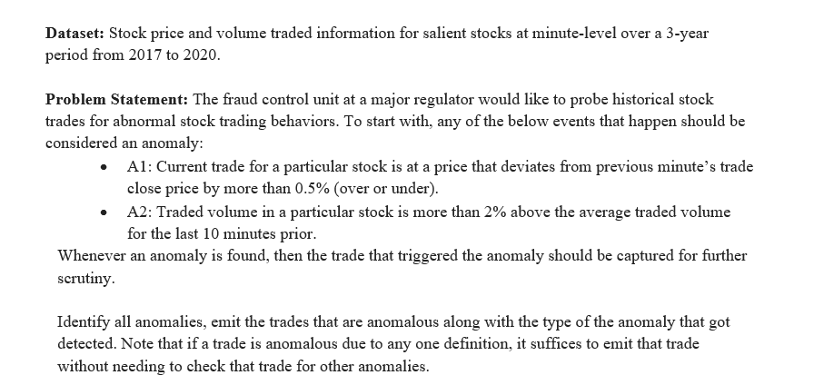

# Stock Anomaly Detection System

## Problem Statement

  

## My Approach

-	Deployed a cloud-based stock anomaly detection pipeline using Google Cloud VMs.
-	Provisioned and configured three VMs: Kafka broker, data producer, and Spark Streaming consumer.
-	Implemented a producer to convert the batch data into a data stream by loading into Kafka using Spark batch. It also performed data cleaning operations like removing the rows with missing field, dealing with the bad rows, and sorting the data in ascending order by time.
-	Built a Spark Streaming consumer to read trade data from the kafka topic such that stream is read minute by minute and the anomaly testing happens.
-	Additionally, spark streaming code will publish a warning text message “Traded Volume more than 2% of its average” to a Google Pub/Sub topic ONLY if the anomaly detected is of type A2.

## Dataset
- [Dataset Link](https://drive.google.com/drive/folders/19OCvXvagQ32xXfYMFkAk1w7rv3V-kk27?usp=sharing)

## Report  
- [View the PDF](/Stock_Anomaly_Detection_System_Report.pdf)

## Video Presentation  

